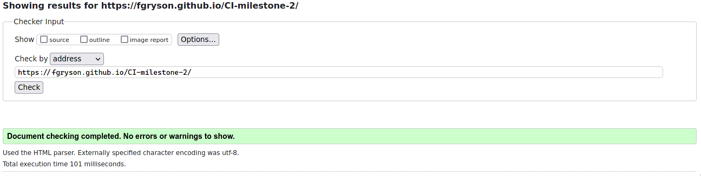
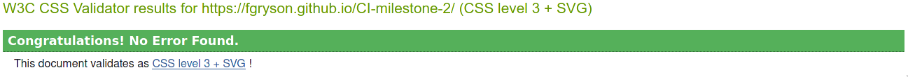
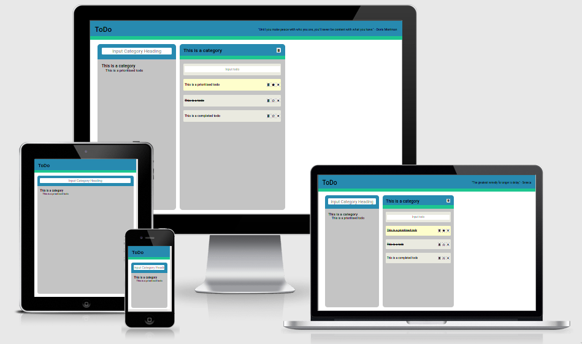

# Testing

## Code validators

The HTML validator returned no errors:

The CSS validator returned no errors:

## Responsiveness

|              | **Responsive** |
| ------------ | :------------: |
| Desktop      |       ✅        |
| Laptop       |       ✅        |
| Galaxy S9    |       ✅        |
| iPad         |       ✅        |
| iPhone 5     |       ✅        |
| iPhone 6/7/8 |       ✅        |
| iPhone X/XS  |       ✅        |

## Browser Compatibility

Browsers tested:

- Firefox
- Chrome
- Edge
- Edge Mobile
- Chrome Mobile

In this testing I found no issues with responsiveness, appearance or functionality.

## Testing User Stories

- As a user, I want to create a shopping list.
  - entering in "shopping list" as a category is an easy way to organise this kind of activity, this is most useful when the site is on mobile as data is saved per device.
- As a user, I want to see the progress of my tasks.
  - As tasks are added, deleted, and completed the appropriate progress bars are updated to show the relative progress. In the case of the total progress it's dynamically updated even when a category is deleted.
- As a user, I want to prioritise certain tasks.
  - Clicking the prioritise button not only organises the task to the top of it's category but also adds it to the summary in the category form.
- As a user, I want my progress automatically saved and restored.
  - The progress is saved every time the user changes a category or adds a category, due to it being in localStorage it is per device but it still maintains data over sessions. When the app is initially loaded and there is no previous data saved to localStorage a small demonstration category is shown to display the app's basic features.
- As a user, I want to categorise my tasklists to be more organised.
  - As categories are added they are tiled after the category form, they are also accessible through the the summary.
- As a user, I want to remove a task that's no longer relevant.
  - Every todo, and category, can be deleted if it is no longer relevant through pressing the 'delete' button.
- As a user, I want to retitle a category I've created.
  - Clicking on an existing category brings up a text input that allows the user to retitle the category as they wish.
- As a user, I want a short summary of my categories and their prioritised tasks.
  - A summary of each category and its prioritised todos is generated and displayed in the category form.

## Bugs

- One of the more difficult bugs to resolve was the binding of DOM data to the data as stored in my ToDoApp object, I resolved this problem by redrawing the app after every edit to the ToDoApp object. This way both the DOM and ToDoApp object remained linked without one containing irrelevant information.
- As the application uses a lot of nested data with categories containing todos I made use of data properties in the dynamic HTML to keep track of what was being edited in my ToDoApp object. This approach was the result of many strange bugs when data would become uncoupled from its DOM representation.
- The app initially had some issues with overflowing content, this was resolved with some form validation and use of CSS overflow properties.
- The user could enter html code and thus create strange rendering bugs, the application of a String.filter with a regex that matched against all html tags and sanitises them fixed this issue.

[return to README](README.md)
